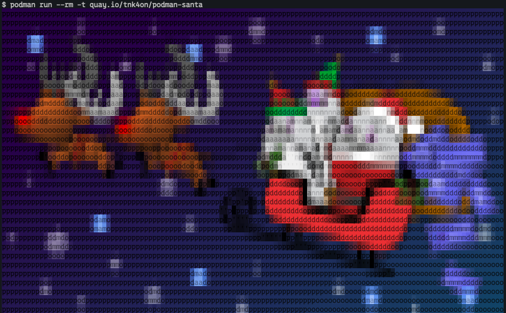

# Podman Santa(Ascii Art)
This container image converts a PNG image to "Ascii Art" and displays it in the terminal.
- Git Repo:[https://github.com/tnk4on/podman-santa](https://github.com/tnk4on/podman-santa)

Original PNG image


Ascii Art



## jp2a
This container image uses **jp2a** to convert the image to Ascii Art.
jp2a is a simple JPEG/PNG to ASCII converter.

- Git Repo:[https://github.com/Talinx/jp2a/](https://github.com/Talinx/jp2a/)

Command example
```
jp2a --colors --fill --color-depth=24 --chars="podman" santaseal.png --width=120
```

## Original PNG image

[Release Notes - Podman Desktop 1.6 | Podman Desktop](https://podman-desktop.io/blog/podman-desktop-release-1.6)

## How to use
```
podman run --rm -t quay.io/tnk4on/podman-santa
```

Change output size(default width=120)
```
podman run --rm -t quay.io/tnk4on/podman-santa --width=200
```

## Build
Default architecture is arm64(aarch64)
```
git clone https://github.com/tnk4on/podman-santa.git
cd podman-santa
podman build -t quay.io/tnk4on/podman-santa .
```

for adm64(x86_64)
```
export ARCH=amd64
podman build --build-arg ARCH=${ARCH} --platform linux/${ARCH} -t test:${ARCH} .
```